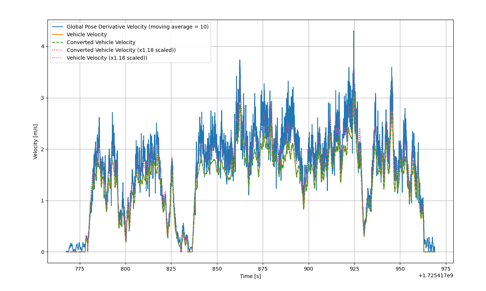
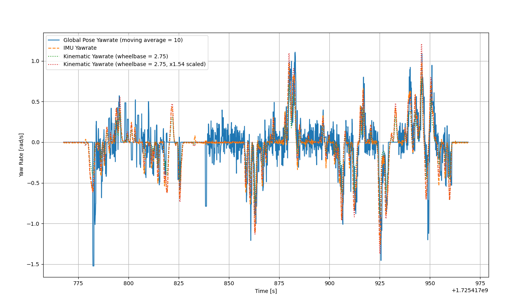

# dev_script
some useful scripts for development


## ROS

### report_all_topic_info_hz.py

全ros topicのhz、pub/sub numを計測


## autoware


### compare_repos_check_latest_tag.sh

2つのreposファイルの差分を比較


### autoware_data_checker

Global pose (NDT, GNSS, etc.) から計算した速度と車速を比較して、センサー出力情報が正しいことを確認する。
Global pose (NDT, GNSS, etc.) から計算した角速度とIMUの角速度、車速とステア角からキネマティクスモデルを用いて計算した角速度を比較して、種々のセンサー出力情報が正しいことを確認する。


```
python3 autoware_data_checker.py -r <path-to-rosbag>
```

出力例：






```txt
---------------------------------
Setting:
 - wheelbase = 2.75 [m]
 - global_pose_topic (global estimation logic e.g. NDT, GNSS) = /sensing/gnss/pose_with_covariance
 - vehicle_velocity_topic (vehicle original status) = /vehicle/status/velocity_status
 - vehicle_steering_topic (vehicle original steering) = /vehicle/status/steering_status
 - twist_estimator_topic (modified velocity status) = /sensing/vehicle_velocity_converter/twist_with_covariance
 - imu_topic = /sensing/imu/imu_data
---------------------------------
---------------------------------
topic data num:
 - global_pose = 3218
 - vehicle_velocity = 3218
 - vehicle_steering = 10078
 - twist_estimator = 3218
 - imu = 3218
---------------------------------
---------------------------------
Velocity Analysis:
- Average difference between global_pose_velocity and twist_estimator_velocity: 0.28663.
    - Note: This is performed for data with twist_estimator_velocity >= 0.01 to ignore noise effect when stationary.
    - Note: If this value exceeds 0.3, vehicle velocity is not accurate -> do velocity calibration (apply scale factor, etc.), or global pose is broken -> change data.
    - Optimal scale factor for vehicle_velocity_converted: 1.1756
- Average difference between global_pose_velocity and vehicle_velocity: 0.28664.
    - Note: This is performed for data with twist_estimator_velocity >= 0.01 to ignore noise effect when stationary.
    - Note: If this value exceeds 0.3, vehicle velocity is not accurate -> do velocity calibration (apply scale factor, etc.), or global pose is broken -> change data.
    - Optimal scale factor for vehicle_velocity: 1.1756
---------------------------------
---------------------------------
Yaw Rate Analysis:
 - Average difference between global_pose_yawrate and imu_yawrate: 0.15848
!!! CAUTION !!! difference is toot large, need calibration.
    - Note: If this value exceeds 0.03, imu_yawrate is not accurate -> do IMU calibration (remove bias, etc.), or global pose is broken -> change data.
    - Optimal scale factor for imu_yawrate: 0.69551
 - Average difference between global_pose_yawrate and kinematic_yawrate: 0.14324
!!! CAUTION !!! difference is toot large, need calibration.
    - Note: If this value exceeds 0.03, vehicle steering or vehicle velocity is not accurate -> do calibration (remove steering bias, apply steering scale, etc.), or global pose is broken -> change data.
    - Optimal scale factor for imu_yawrate: 1.049
 - Average difference between imu_yawrate and kinematic_yawrate: 0.060949
!!! CAUTION !!! difference is toot large, need calibration.
    - Note: If this value exceeds 0.03, vehicle steering or vehicle velocity or imu yawrate is not accurate -> do calibration with further investigation.
    - Optimal scale factor between imu_yawrate and kinematic_yawrate: 1.5446
---------------------------------
```